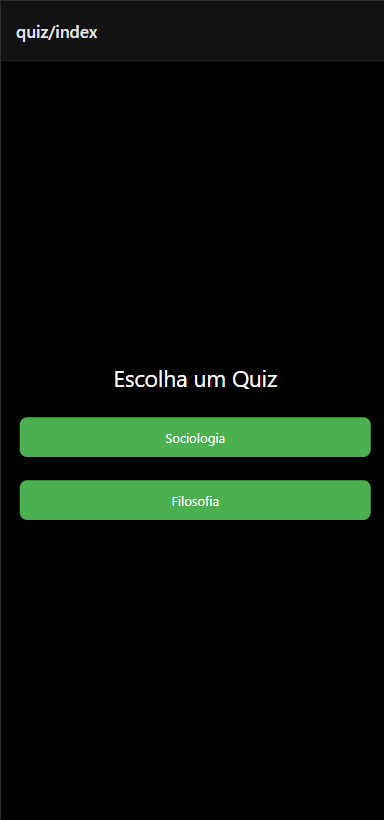

# Quiz de Sociologia e Filosofia

## Introdução

Este projeto consiste no desenvolvimento de um aplicativo de quiz com foco nas disciplinas de **Sociologia e Filosofia**. A proposta foi criar uma experiência simples e intuitiva, de um app de uma matéria da escola.

O quiz foi apresentado ao professor responsável pela disciplina, que realizou uma tentativa completa para avaliação do conteúdo e da usabilidade.

---

## Integrantes do Grupo

- Leandro Saltorato
- Miguel Gerbi
- Italo Mozer
- Matheus Spineli

---

## Tecnologias Utilizadas

- React Native
- Expo

---

## Prints das Telas

---

## Professor Avaliador

- Nome do professor: Rafael

---

## Avaliação do Professor

- Pontuação obtida na primeira tentativa:

**Comentário do professor:**
"O quiz apresenta um bom conteúdo e cumpre seu objetivo de revisar conceitos importantes. A navegação é simples e funcional."

---

## Sugestões de Melhoria

- Melhorar o design da interface para torná-la mais atrativa e moderna.
